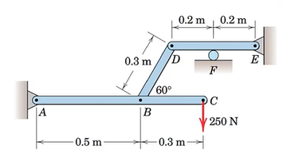

### Solutions for Trusses and Frames using Python!

My Professor ask us to write programs in order to solve trusses and frame problems when given in encoded form in return for a total of 5 marks being added to our end-semester scores. So here it is.
I hope I get those 5 extra marks

This project makes use of the joint, member, unknown_force and known_force classes in order to generate equations of static equillibrium on both, members and joints.
This way of solving questions provides a larger generalisation to problems in which external forces which may or may not be known act on joints

The data of members provided to the truss classes should be encoded in the form mentioned in the Examples. Some examples have been tested and the results are foolproof.

Example 1:
Given the problem:

the solution found out by the program is:
`
{Ax: -300, Ay: 480, Bx: 300, FC1x: 795, FC1y: -216, FC2x: -795, FC2y: 216, FD1x: -495, FD1y: -264, FD3x: 495, FD3y: 264, FE2x: 495, FE2y: 264, FE3x: -495, FE3y: -264}
`

Example 3:
Given the problem:

the solution found out by the program is:
`
{Ax: -230.940107675850, Ay: -150.000000000000, Ex: 230.940107675850, Ey: -400.000000000000, FB1x: 230.940107675850, FB1y: 400.000000000000, FB2x: -230.940107675850, FB2y: -400.000000000000, FD2x: 230.940107675850, FD2y: 400.000000000000, FD3x: -230.940107675850, FD3y: -400.000000000000, Fy: 800.000000000000}
`

which are both entirely correct

__Created for my **Basic Engineering Mechanics** Class__